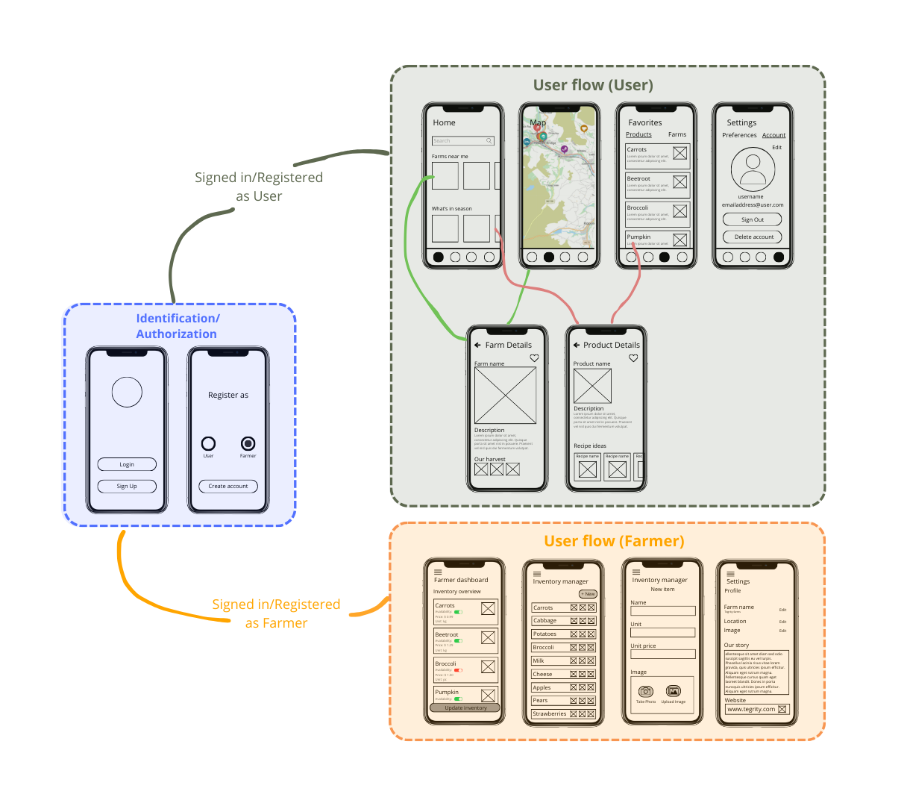

# Project objective

The goal of FarmHands mobile app is to connect consumers with local farmers, encouraging sustainable, seasonal and community-based consumption.
Through an easy-to-use mobile applicaton, users can view nearby farms, see what they have on offer and support local agriculture.
Farmers can easily update and manage their inventory, effectively showcasing the fruits of their labor and reaching local buyers.

## Description

### Objective

- (Re)Connect communities with local farmers for farm-fresh products.
- Encourage local consumption, reducing our carbon footprint.
- Promote healty, seasonal eating.

### Who is it for?

- Consumers willing to go out of their way to consume locally and get the freshest seasonal products.
- Farmers who wish to connect with their local community to sell their products but also educate people on what they do.

### For consumers

- Explore nearby farms and products via the search function or in the map view.
- Save favorite farms or products for easy access and receive notifications.
- Adjust settings for notification, dietary preferences and your user account.
- View farm details to see what they currently have on offer, learn their story and get directions.
- View product details to see an image and description of the product.
- Discover recipe ideas based on your preferences.

### For farmers

- Set up account so people can find you and tell them your story.
- Create inventory for consumers to easily see what you have available.
- Add images using you phone's built-in camera or choose from your photo gallery to give a clear view of your product.
- Stay updated by easily updating and removing products as needed.

## Online strategy

- [X] Online CRUD with a Backend Service:
      
      - Firebase Firestore (CRUD)
      - Firebase Authentication
      - Firebase Cloud Messaging (push notifications)

## Mobile features

- [X] Platformintegrations

      - Camera
      - File system (photo gallery)
      - Location
      
- [X] Push notifications
- [ ] 2D Graphics
- [X] Authentication and Authorization
- [ ] Native Communication
- [ ] Native Speech to Text
- [ ] Cross-platform Native Plugin
- [ ] Other: 

## Wireframes

