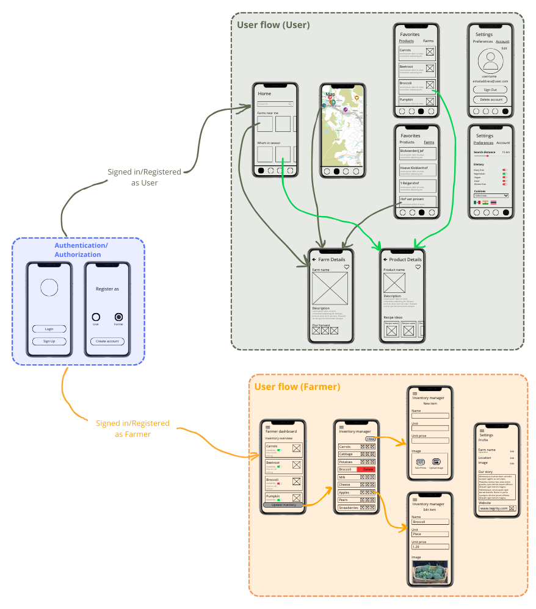

# Project objective

The goal of FarmHands mobile app is to connect consumers with local farmers, encouraging sustainable, seasonal and community-based consumption.
Through an easy-to-use mobile applicaton, users can view nearby farms, see what they have on offer and support local agriculture.
Farmers can easily update and manage their inventory, effectively showcasing the fruits (and vegetables) of their labor and reaching local buyers.

## Description

### Objective

- (Re)Connect communities with local farmers for farm-fresh products.
- Encourage local consumption, reducing our carbon footprint.
- Promote healty, seasonal eating.

### Who is it for?

- Consumers willing to go out of their way to consume locally and get the freshest seasonal products.
- Farmers who wish to connect with their local community to sell their products as well as educate people on what they do.

### For consumers

- Explore nearby farms and products via the search function or in the map view.
- Save favorite farms or products for easy access and receive notifications.
- Adjust settings for notifications, dietary preferences and your account.
- View farm details to see what they currently have on offer, learn their story and get directions.
- View product details to see an image and description of the product.
- Discover recipe ideas based on your preferences.

### For farmers

- Set up account so people can find you and tell them your story.
- Create inventory for consumers to easily see what you have available.
- Add images using your phone's built-in camera or choose from your photo gallery to give a clear view of your products.
- Stay updated by easily updating and removing products as needed.

## Online strategy

- [X] Online CRUD with a Backend Service:
      
      - Firebase Firestore (CRUD)
      - Firebase Authentication
      - Firebase Cloud Messaging (push notifications)

## Mobile features

- [X] Platform integrations

      - Camera
      - File system (photo gallery)
      - Location
      
- [X] Push notifications
- [ ] 2D Graphics
- [X] Authentication and Authorization
- [ ] Native Communication
- [ ] Native Speech to Text
- [ ] Cross-platform Native Plugin
- [ ] Other: 

## Extra feature ideas

- Recipe idea generation via API or integration with known recipe app. Ideas are based on product, cuisine and dietary preferences set by user.
- Sharing options for farms, products and recipes.
- User reviews and ratings to establish trust and provide farmers with constructive feedback.
- Sustainability insights showing the consumer's environmental impact buying the selected item locally vs. at the supermarket.
- Badges for farms that follow sustainable practices (e.g. bio, organic, regenerative farming).
- Subscription and pre-ordering for pickup options.
- Educational section to learn about seasonal eating, including content outlining the health and environmental benefits.
- Farm tours and workshops where users can sign up to visit the farms and learn about the practices or even participate in workshops. 

## Wireframes

